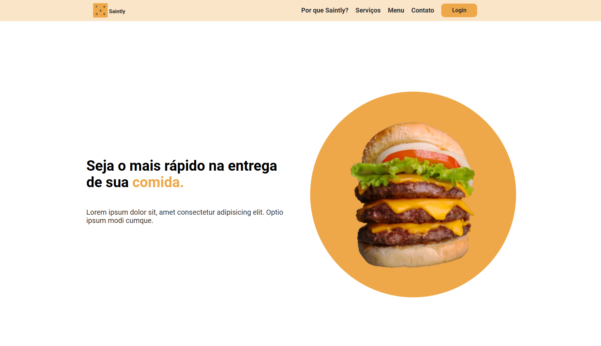

<h1 align="center">
Food-Saintly 🍔
</h1>



<h4 align="center"><a href="https://foodsaintly.netlify.app/">Clique para visitar o projeto</a></h4>

## 💬 Sobre o projeto

#### FoodSaintly é uma aplicação web de entrega de alimentos moderna, desenvolvida para oferecer uma experiência de usuário simples e eficiente. O projeto foi criado com o objetivo de colocar em prática meus conhecimentos em desenvolvimento web, com ênfase na interface e na responsividade.

## 🛠️ Instalação do Frontend

Clone este repositório usando o comando

```
git clone https://github.com/Lucassocorrosilva7/Food-Saintly.git
```

Entrar na pasta utilizando o comando:

```
cd Food-Saintly-main
```

Instale as dependências com o comando:

```
npm i
```

Para executar o gulp utilize o comando:

```
gulp dev
```

## 💻 - Seções

- Por que Saintly?
- Serviços
- Menu
- Contato
- Login

## ⚡ - Tecnologias utilizadas

- HTML5;
- Font-awesome;
- Sass
- BEM;
- Javascript;
- Gulp;

## 👤 Autor

#### Feito por Lucas Silva. Entre em contato! 👇

<a href="https://lucas-bio.netlify.app/"></a>
<a href="https://www.linkedin.com/in/luquinhasssilva/"></a>
<a href="mailto:someone@lucassocorrosilva@gmail.com"></a>
